物联网设备知识图谱交互管理平台需求规格说明书
Version1.0.0

小组成员：吴俊安、帅军锐、吴思扬、林世颖

学号	姓名	班级	项目角色	业务分工	
32306300011	吴俊安	软件(创)231	队长	文档骨架构建+子系统A		
32306300010	吴思扬	软件(创)231	组员	子系统B		
32306300017	帅军锐	软件(创)231	组员	子系统C		
32406100103	林世颖	计科243	组员	子系统D	

目录
一、 变更情况记录	3
二、 概述	3
2.1背景	3
2.2目的	3
2.3范围	3
2.4假设	4
2.5业务语	4
2.6参考文献	5
三、 系统整体描述	5
3.1系统业务目标	5
3.2系统分解与子系统职责	5
3.2.1子系统A：设备接入与安全认证子系统【由吴俊安负责】	6
3.2.2子系统B：设备监控与安全运维子系统【由吴思扬负责】	6
3.2.3子系统C：设备资产与配置管理子系统【由帅军锐负责】	6
3.2.4子系统D：知识图谱分析与智能服务子系统【由林世颖负责】	6
四、 用例列表	7
五、 用例文档	10
5.1子系统A用例文档（由【吴俊安】负责）	10
5.2子系统B用例文档（由【吴思扬】负责）	14
5.3子系统C用例文档（由【帅军锐】负责）	19
5.4子系统D用例文档（由【林世颖】负责）	19
六、 非功能性需求	24
6.1可靠性	24
6.2可用性	25
6.3有效性	25

一、变更情况记录
*A-ADDED（新增）M-MODIFIED（修改）D-DELETED（删除）

变更号	日期	段落	*A、M、D	简述	备注
a.0.0.1	2025-11-3	全文骨架	A	说明书生成	by吴俊安
a.0.0.2	2025-11-12	全文骨架	M	新增成员调整	by吴俊安

二、概述
2.1背景	
随着物联网技术的飞速发展，海量的智能设备被部署到工业制造、智慧城市、智能家居等各个领域。设备数量的激增和设备类型的多样化，使得传统的、基于孤立数据点的设备管理方式面临巨大挑战。这些挑战主要体现在：
数据孤岛问题：设备产生的状态、告警、日志等数据分散在不同的管理子系统或数据库中，缺乏有效的关联和整合，难以形成全局视图。
关联分析薄弱：无法有效理解设备之间、设备与环境之间的复杂关联关系。例如，当一个网络交换机发生故障时，运维人员难以快速、准确地评估受影响的终端设备范围，导致故障定位和影响分析效率低下。
管理效率瓶颈：设备的注册、监控、运维等操作仍依赖大量人工干预，自动化、智能化程度不足，难以满足大规模设备集群的管理需求。
知识图谱技术以其强大的语义表达、关联推理和可视化能力，为上述问题提供了理想的解决方案。通过构建以设备为核心的知识图谱，可以将碎片化的设备信息整合成一张相互关联的“知识网络”，从而实现对设备资产及其复杂关系的深度认知与智能管理。

在此背景下，开发“物联网设备知识图谱交互管理平台”旨在利用知识图谱这一前沿技术，构建一个统一的、智能化的设备管理中枢，提升设备管理的自动化水平、运维效率和数据价值挖掘能力。
2.2目的
本需求规格说明书的根本目的是为“物联网设备知识图谱交互管理平台”的设计、开发、测试和验收提供明确、详尽的依据。具体目的包括：

1.定义系统边界与目标：清晰界定本平台需要实现的功能范围、需要达成的业务目标以及需要遵守的约束条件。
2.指导开发过程：作为项目开发团队（包括架构师、设计师、程序员等）的核心技术输入，确保开发活动与用户需求保持一致。
3.作为验收标准：为测试团队提供验证系统功能正确性的基准，并作为项目最终交付和验收的评判标准。
4.满足实验教学要求：本文档的撰写过程本身也是对《软件需求工程》或类似课程实验要求的实践，旨在让项目成员熟练掌握基于用例的面向对象需求分析方法，并熟练运用UML工具进行需求描述与分析。
2.3范围
本平台是一个面向企业级用户的B/S架构软件系统，其核心范围涵盖以下几个方面：

纳入范围：
设备全生命周期管理：支持从设备注册、认证、配置、监控、运维到退役的整个生命周期管理功能。
知识图谱构建与存储：能够从各类数据源（如数据库、API接口）中抽取设备实体、属性及其关系，自动或半自动地构建和更新设备知识图谱，并实现高效存储与查询。
关联关系可视化与分析：提供直观的图交互界面，支持设备知识图谱的可视化浏览、多维度的关联查询（如查询设备影响范围、追溯故障根源）和路径分析。
子系统协同：包括设备接入与核心管理（A）、设备监控与安全运维（B）和知识图谱分析与数据服务（C）三个子系统的全部功能，并确保子系统间接口的顺畅协作。
排除范围：
具体的物联网设备硬件生产与嵌入式软件开发：本平台是上层管理软件，不涉及底层设备硬件的制造或设备端嵌入式固件的开发。
底层网络基础设施的建设：如5G基站、Wi-Fi路由器的部署等网络硬件设施不在本平台范围内。
详细的硬件运维操作：如现场更换设备零件等物理操作，平台仅提供远程指令下发和状态监控，不包含实际物理执行。

2.4假设
为确保项目可行性和需求稳定性，提出以下假设条件：

1.技术可行性：假设当前主流的知识图谱数据库（如Neo4j,NebulaGraph）、微服务框架、前端可视化库等技术成熟可靠，能够满足本平台的性能与功能要求。
2.数据可获得性：假设待管理的物联网设备具备标准化的通信协议（如MQTT,CoAP）和数据格式，平台能够通过定义的接口稳定地获取设备数据。
3.用户专业性：假设平台的主要使用者（如系统管理员、运维工程师）具备基本的物联网和网络知识，能够理解知识图谱的基本概念，无需进行基础知识的普及培训。
4.运行环境：假设平台将部署在稳定、安全的服务器环境中，具备足够的计算、存储和网络资源保障。网络安全（如防火墙、VPN）由基础设施团队负责。
5.实验环境：假设实验小组成员能够熟练使用指定的UML建模工具（如EnterpriseArchitect），并具备完成实验所需的软件开发基础知识。
2.5业务语
业务活动	触发条件	主要流程步骤
设备接入与认证	新设备到货并准备接入网络。	1.管理员录入设备信息，发起注册。
2.系统生成唯一设备标识与安全凭证。
3.设备使用凭证与平台建立安全连接。
4.系统验证凭证，完成认证，设备状态置为“已注册”。
设备远程配置与控制	设备注册成功，或需要修改运行参数。	1.管理员选择目标设备，下发配置指令（如更新固件、修改参数）。
2.平台将指令封装并安全下发至设备。
3.设备执行指令并返回结果。
4.平台更新设备配置状态并记录日志。
设备监控与诊断	平台持续运行，定时采集设备数据。	1.平台定时从设备采集性能指标（如CPU、内存、在线状态）。
2.数据被持久化存储并实时显示在监控仪表盘。
3.系统根据规则判断数据是否异常。
4.若异常，则触发下一业务流程（“告警处理”）。
告警处理	监控数据满足预设的告警条件。	1.系统自动生成告警事件，通知相关运维人员。
2.运维人员查看告警详情及设备关联影响（通过知识图谱）。
3.运维人员执行处理措施（如远程重启、派发工单）。
4.确认问题解决后，关闭告警并记录全过程。
知识图谱构建与更新	新设备注册成功，或设备数据发生变化。	1.从设备管理、监控等子系统的数据源中抽取实体（设备、位置等）和关系。
2.进行数据清洗、转换，并映射到知识图谱模型。
3.将实体和关系导入/更新到知识图谱数据库中。
关联查询与影响分析	运维人员需要评估设备变更或故障的影响范围。	1.用户在交互界面选择目标设备，发起关联查询请求。
2.知识图谱服务执行图查询算法，找出所有关联设备与路径。
3.结果以可视化图谱和列表形式返回给用户。
4.用户可基于结果进行决策（如隔离故障区域）。
2.6参考文献
1. 《软件工程—实践者的研究方法》（原书第8版）， Roger S.Pressman, Bruce R.Maxim 著。
2. UML 2.5.1 规范， Object Management Group (OMG).
3. 《需求工程：基础、原理和技术》， [德]克劳斯·皮尔 等著。
4. 实验任务书：《物联网设备知识图谱交互管理平台需求分析实验》。
5. Enterprise Architect 用户指南。
三、系统整体描述
3.1系统业务目标
本系统——物联网设备知识图谱交互管理平台——的核心业务目标是构建一个集设备管理、智能监控与深度数据分析于一体的综合性、智能化管理平台。旨在解决传统物联网设备管理中存在的“数据孤岛”、运维效率低下、故障定位困难、安全风险高等问题。具体业务目标分解如下：
1. 实现设备的全生命周期集中化管理：从设备的注册、认证、配置、监控、维护到最终的退役，提供一站式的自动化管理流程，显著降低人工运维成本，提高操作效率与准确性。
2. 建立实时、可视化的设备监控与安全运维体系：通过实时采集设备运行状态、性能指标与安全日志，提供直观的监控仪表盘与智能告警机制，使运维人员能够快速发现、定位并响应设备异常与安全威胁，保障业务连续性。
3. 构建基于知识图谱的设备关联分析与智能决策支持能力：打破设备间的数据隔离，通过知识图谱技术挖掘设备之间、设备与业务系统之间的复杂关联关系。从而实现：
影响分析：快速定位某个设备故障可能波及的相关设备和业务。
根因分析：辅助运维人员从复杂的告警事件中找出根本原因。
智能洞察：基于图谱数据发现潜在优化点和安全风险，为业务决策提供数据支撑。
4. 确保平台的高可靠性、高安全性与可扩展性：满足企业级应用对系统稳定性、数据安全性和未来业务增长的需求。
3.2系统分解与子系统职责
为实现上述复杂的业务目标，本系统采用分层、模块化的设计思想，将其分解为三个核心子系统。各子系统职责清晰、相互协作，共同构成平台的完整功能体系。子系统间的协作关系如下图所示：

图1：子系统架构图

3.2.1子系统A：设备接入与安全认证子系统【由吴俊安负责】
本子系统是平台的第一道防线和接入枢纽，专注于设备的连接建立、身份验证和基础通信保障。
核心职责：
    1. 多协议设备接入网关：支持MQTT、CoAP、HTTP等多种物联网协议的设备接入，实现高并发连接管理和低延迟通信。
    2. 设备身份认证与安全管理：负责设备的注册、数字证书/密钥的生成与验证，确保只有合法设备能够接入平台。
    3. 安全通信加密：实现端到端的TLS/SSL加密通信，保障数据传输的安全性。
    4. 连接状态管理：维护设备连接状态，处理设备上下线事件，提供基础心跳检测机制。
3.2.2子系统B：设备监控与安全运维子系统【由吴思扬负责】
本子系统是平台的“眼睛”和“指挥中心”，面向运维人员，提供对设备集群实时状态的感知和主动运维操作能力。
核心职责：
    1. 实时状态监控与可视化：从子系统A接收标准化后的设备数据，提供设备实时状态（在线/离线）、性能指标（CPU、内存、温度等）的可视化仪表盘。
    2. 告警策略管理与事件处理：允许用户自定义告警规则（如阈值告警、突变告警），自动检测设备异常并生成告警事件。提供告警事件的列表、筛选、确认、派单和闭环处理流程（对应`UC102 处理设备告警`）。
    3. 日志聚合与审计：集中存储和检索设备操作日志、安全日志及平台自身运行日志，满足安全审计与故障排查需求。
    4. 运维自动化：提供一些预定义的运维脚本或工作流，实现常见的运维操作（如批量重启、一键巡检）的自动化执行。

3.2.3子系统C：设备资产与配置管理子系统【由帅军锐负责】
本子系统是平台的设备资产管理中心，负责设备的全生命周期管理和远程控制。
核心职责：
    1. 设备元数据管理：建立完整的设备信息档案，包括设备ID、型号、规格、位置信息、所属项目等静态属性管理。
    2. 远程配置与控制：支持设备参数的远程查询、批量配置修改、设备重启、固件升级（OTA）等操作。
    3. 设备生命周期管理：基于图谱数据和机器学习算法，提供预测性维护（预测设备故障）、异常检测、资源优化等智能分析服务。
    4. 批量操作支持：提供设备分组、批量配置下发、批量状态查询等高效管理功能。
3.2.4子系统D：知识图谱分析与智能服务子系统【由林世颖负责】
本子系统是平台的智能核心，基于知识图谱技术提供深度数据分析和智能决策支持。
核心职责：
    1. 知识图谱构建与更新：从子系统A、B、C获取设备数据，动态构建和更新设备知识图谱，建立设备间的语义关系网络。
    2. 智能分析与预测：基于机器学习算法提供预测性维护、异常检测、资源优化等智能分析服务。

    3. 关联关系挖掘：深度分析设备间的关联影响，支持拓扑查询、影响范围分析等复杂查询。
    4. 数据服务API：为外部系统提供标准化的数据查询和分析服务接口，支持业务系统集成。

四、用例列表
备注：子系统用例标号命令格式：UC-系统标号-数字标号，如A系统的第一个用例标号为UC-A-001
UC-A：吴俊安
UC-B：吴思扬
UC-C：帅军锐
UC-D：林世颖
用例编号	用例名	用例概述	参与者
UC-A-001	设备连接建立	设备通过MQTT/CoAP/HTTP等协议与平台建立初始连接	物联网设备
UC-A-002	设备身份认证	验证设备提供的身份凭证（证书/密钥/令牌）	物联网设备
UC-A-003	维持心跳连接	设备定期发送心跳包维持连接状态	物联网设备
UC-A-004	安全断开连接	设备正常终止与平台的连接	物联网设备
UC-A-005	验证设备证书	验证设备数字证书的有效性和签名	物联网设备
UC-A-006	处理认证失败	认证失败时的错误处理和重试机制	物联网设备
UC-A-007	重新认证	会话过期后的重新认证流程	物联网设备
UC-A-008	处理心跳超时	心跳包超时时的连接恢复或清理	物联网设备
UC-A-009	清理会话数据	断开连接时清理相关会话信息	物联网设备
UC-A-010	处理异常断开	网络异常等非正常断开处理	物联网设备
UC-A-011	注册新设备	管理员在平台中预注册设备并生成安全凭证	系统管理员
UC-A-012	生成设备ID	为设备生成唯一标识符	系统管理员
UC-A-013	生成安全密钥	为设备生成认证密钥或证书	系统管理员
UC-A-014	批量导入设备	支持Excel批量导入设备信息	系统管理员
UC-A-015	单个设备注册	单个设备的注册流程	系统管理员
UC-A-016	批量设备注册	批量设备的注册流程	系统管理员
UC-A-017	配置安全策略	设置认证参数、加密算法、会话超时等安全策略	系统管理员
UC-A-018	配置审计日志	配置安全审计相关参数	系统管理员
UC-A-019	配置加密算法	设置通信加密算法	系统管理员
UC-A-020	配置会话超时	设置会话超时时间	系统管理员
UC-A-021	配置认证级别	设置认证强度级别	系统管理员
UC-A-022	查看连接状态	查看当前在线设备统计和详细连接信息	系统管理员
UC-A-023	验证查看权限	验证管理员查看权限	系统管理员
UC-A-024	导出状态报告	导出连接状态统计报告	系统管理员
UC-A-025	强制设备下线	管理员强制异常或可疑设备断开连接	系统管理员
UC-A-026	验证操作权限	验证强制下线操作权限	系统管理员
UC-A-027	记录强制下线	记录强制下线操作日志	系统管理员
UC-A-028	查询设备在线状态	应用系统查询指定设备的在线/离线状态	企业用户
UC-A-029	验证查询权限	验证应用系统查询权限	企业用户
UC-A-030	生成状态快照	生成设备状态历史快照	企业用户
UC-A-031	验证访问令牌	验证设备访问令牌的有效性和权限	企业用户
UC-A-032	检查令牌有效期	验证令牌是否在有效期内	企业用户
UC-A-033	刷新访问令牌	令牌即将过期时自动刷新	企业用户
UC-A-034	查询认证日志	审计员查询设备接入和认证的历史记录	安全审计员
UC-A-035	导出日志文件	将日志导出为文件	安全审计员
UC-A-036	按时间查询	按时间范围查询日志	安全审计员
UC-A-037	按设备查询	按设备ID查询日志	安全审计员
UC-A-038	按结果查询	按认证结果查询日志	安全审计员
UC-A-039	生成安全报告	生成设备接入安全合规性报告	安全审计员
UC-A-040	收集审计数据	收集相关审计数据	安全审计员
UC-A-041	分析安全指标	分析安全合规指标	安全审计员
UC-A-042	导出PDF报告	将报告导出为PDF格式	安全审计员
UC-B-001​	处理设备安全警报	当安全监控系统检测到设备异常行为（如非法访问、流量异常）时，会生成警报。系统管理员查看警报，分析详情，执行必要的应急响应操作（如隔离设备），并最终将警报标记为已处理。	系统管理员（主要），安全监控系统（次要）
UC-B-002​	执行设备远程诊断	运维人员对性能异常或报告故障的设备发起远程诊断。系统收集设备的实时状态、运行日志和性能快照并生成报告。运维人员分析报告以定位问题原因，并可执行远程修复操作（如重启服务）。	运维人员（主要），系统管理员（主要）
UC-B-003​	部署设备固件更新	系统管理员为一批设备部署新的固件版本以修复漏洞或增强功能。管理员创建更新任务，选择目标设备和固件，设定更新策略（如立即执行或定时任务）。系统推送更新并监控过程，生成详细报告。	系统管理员（主要）
UC-B-004​	配置监控与警报规则	系统管理员定义需要监控的设备性能指标（如CPU、内存阈值）和安全事件规则。当设备数据满足规则条件时，系统自动生成警报或触发特定动作。	系统管理员（主要）
UC-B-005​	查看设备监控仪表板	运维人员或管理员通过统一的图形化仪表板，实时查看所有设备的整体健康状况、关键性能指标（KPI）分布、警报统计等信息，快速掌握系统全局状态。	系统管理员，运维人员
UC-B-006​	执行安全审计与合规检查	系统定期或按需自动执行安全扫描和合规性检查，对照安全基线评估设备配置，生成审计报告，指出不符合项，确保系统符合安全规范。	系统管理员（主要）
UC-B-007​	管理设备生命周期状态	系统管理员对设备进行全生命周期状态管理，包括将新设备投入运营、暂停故障设备、以及安全地退役旧设备（擦除数据、注销凭证）。	系统管理员（主要）
UC-C-001	管理用户账户	系统管理员执行用户账户的管理操作，如创建、修改、删除用户账户。	系统管理员
UC-C-002	管理系统权限	系统管理系统权限的设置和修改，包括授予、撤销权限等。	系统管理员
UC-C-003	管理系统配置	系统管理修改系统配置参数，确保系统正常运行。	系统管理员
UC-C-004	维护系统日志	系统管理员查看和维护系统日志，包括归档和清理。	系统管理员
UC-C-005	监控系统健康	运维工程师监控系统健康指标，如CPU、内存使用率。	运维工程师
UC-C-006	部署系统组件	运维工程师部署系统组件或应用程序，确保顺利上线。	运维工程师
UC-C-007	处理系统事件	运维工程师处理系统事件或故障，进行诊断和解决。	运维工程师
UC-C-008	执行系统维护	运维工程师执行系统维护任务，如备份和优化。	运维工程师
UC-C-009	管理项目生命周期	项目管理员管理项目的全生命周期，从创建到关闭。	项目管理员
UC-C-010	管理项目资源	项目管理员管理项目资源分配和调整，确保资源合理利用。	项目管理员
UC-C-011	跟踪项目指标	项目管理员跟踪项目关键指标，如进度和成本。	项目管理员
UC-C-012	沟通项目状态	项目管理员沟通项目状态，生成报告并通知相关方。	项目管理员
UC-C-013	添加用户	添加一个新用户账户到系统中。	-
UC-C-014	记录账户变更日志	当用户账户发生变更时，记录审计日志。	-
UC-C-015	管理外部用户账户	专门管理外部用户账户，如客户或合作伙伴账户。	-
UC-C-016	授予权限	向用户或角色授予特定权限。	-
UC-C-017	记录权限变更	当权限发生变更时，记录日志并通知。	-
UC-C-018	管理细粒度权限	管理细粒度权限设置，如基于资源的权限。	-
UC-C-019	修改配置	修改系统配置参数，如网络或数据库设置。	-
UC-C-020	验证配置	当修改配置时，验证配置值的有效性。	-
UC-C-021	管理网络配置	专门管理网络相关的配置参数。	-
UC-C-022	查看日志	查看系统日志内容，支持过滤和搜索。	-
UC-C-023	归档日志	当日志过大时，自动归档旧日志。	-
UC-C-024	管理审计日志	专门管理审计日志，确保合规性。	-
UC-C-025	检查系统指标	检查系统关键指标，如CPU使用率或磁盘空间。	-
UC-C-026	触发警报	当系统指标异常时，触发警报通知。	-
UC-C-027	监控实时健康	实时监控系统健康状态，提供即时反馈。	-
UC-C-028	安装组件	安装系统组件或软件包。	-
UC-C-029	回滚部署	当部署失败时，回滚到 previous 版本。	-
UC-C-030	部署微服务	专门部署微服务架构的组件。	-
UC-C-031	诊断事件	诊断系统事件的根本原因。	-
UC-C-032	升级事件	当事件严重时，升级事件优先级并通知管理员。	-
UC-C-033	处理安全事件	专门处理安全相关事件，如入侵检测。	-
UC-C-034	执行备份	执行系统数据备份操作。	-
UC-C-035	通知维护窗口	当执行维护时，通知用户维护时间窗口。	-
UC-C-036	执行预防性维护	执行预防性维护任务，防止故障发生。	-
UC-C-037	创建项目	创建一个新项目，定义基本信息和范围。	-
UC-C-038	记录资源变更	当项目资源变更时，记录变更历史。	-
UC-C-039	跟踪敏捷指标	专门跟踪敏捷项目的指标，如迭代速度。	-
UC-C-040	生成状态报告	生成项目状态报告，包括进度和风险。	-
UC-D-001	知识图谱自动构建	从数据源系统自动构建设备知识图谱	子系统A/B/C, 系统管理员
UC-D-002	图谱数据手动更新	手动更新和维护知识图谱数据	系统管理员
UC-D-003	预测性维护分析	基于设备数据预测潜在故障和维护需求	业务用户
UC-D-004	实时异常检测	实时监测设备异常状态并告警	业务用户
UC-D-005	设备资源优化建议	提供设备资源配置优化建议	业务用户
UC-D-006	设备拓扑关系查询	查询设备间的物理和逻辑拓扑关系	业务用户
UC-D-007	影响范围分析	分析设备故障的影响范围和关联设备	业务用户
UC-D-008	关联路径发现	发现设备间的隐藏关联关系和影响路径	业务用户
UC-D-009	图谱数据查询API	提供标准化的知识图谱数据查询接口	业务开发员
UC-D-010	分析服务API	提供智能分析服务的API接口	业务开发员
UC-D-011	图谱质量监控	监控知识图谱数据质量和完整性	系统管理员
UC-D-012	分析模型管理	管理机器学习模型和算法配置	系统管理员
UC-D-013	历史数据分析	对历史设备数据进行趋势和模式分析	业务用户

五、用例文档
5.1子系统A用例文档（由【吴俊安】负责）
画图工具：StarUML-免费版
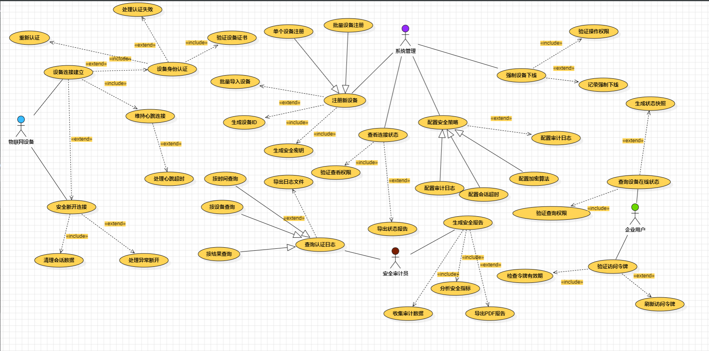
5.1.1UC-A-002设备身份认证
5.1.1.1用例描述
用例号	UC-A-002
用例名称	设备身份认证
用例描述	物联网平台验证设备身份合法性的核心安全流程。设备提供凭证（如证书、密钥），系统验证通过后，设备方可接入平台并进行后续操作。
参与者	物联网设备（主要参与者）
前置条件	1. 设备已在平台预注册，并持有有效的身份凭证。
2. 设备与平台之间的网络连接已初步建立。
3. 平台认证服务正常运行。
后置条件	1. 认证成功：设备状态更新为“已认证”，并获得访问令牌。
2. 认证失败：设备连接被拒绝，并记录安全日志。
基本路径	1. 设备向认证服务发送认证请求，消息中包含其设备标识（Device ID）和签名凭证（如数字证书）。
2. 系统接收请求，验证请求格式的有效性。
3. 系统根据设备标识，查询并获取预置的设备凭证（如公钥）。
4. 系统使用预置凭证验证设备发送的签名或证书的有效性（包括有效期、签名合法性等）。
5. 验证通过，系统生成一个有时效性的访问令牌（Access Token）。
6. 系统将访问令牌返回给设备，并将设备状态标记为“已认证”。
7. 认证成功，设备可使用令牌进行后续通信。
扩展点	1. 未找到设备标识：系统返回错误信息“设备未注册”，并终止连接。
2. 凭证验证失败（如签名错误、证书过期）：系统返回错误信息“认证失败”，记录安全事件，并终止连接。
3. 系统在生成令牌时发生内部错误（如数据库异常）：系统返回错误信息“系统繁忙”，记录日志，并终止连接。
补充说明	 
1. 所有通信应使用TLS/SSL等加密通道进行，防止凭证泄露。
2. 认证失败应有重试次数限制，防止暴力破解。
3. 访问令牌应设置合理的过期时间，并支持到期前刷新。

5.1.1.2用例图
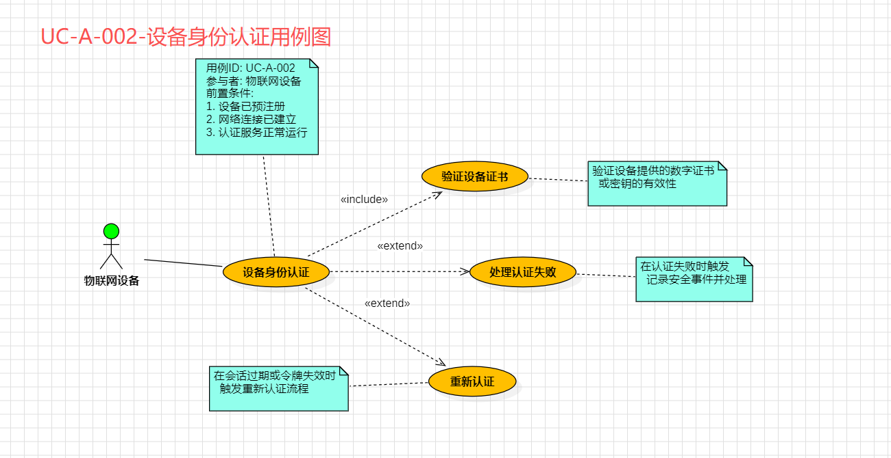
图A-2：设备身份认证用例图
5.1.1.3类图
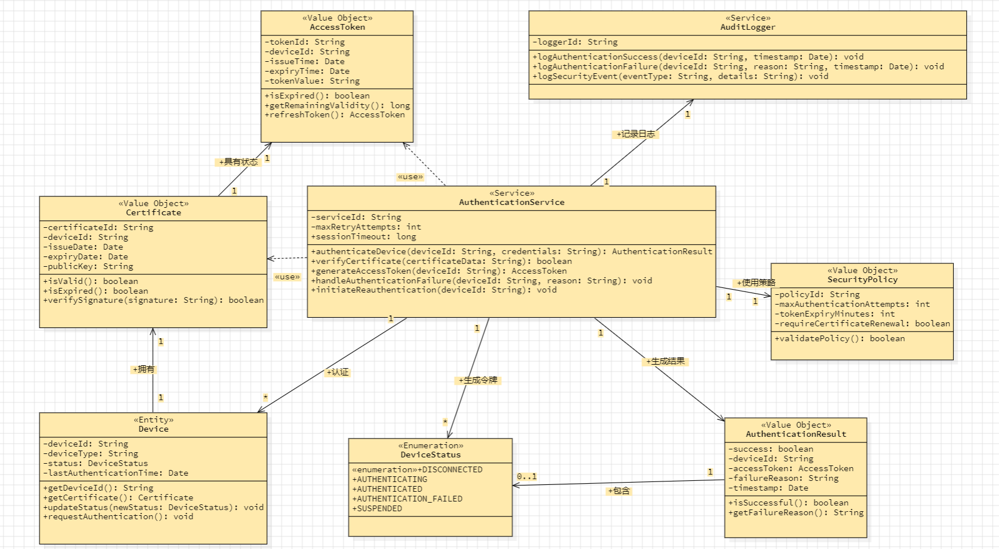
图A-3：设备身份验证类图
本类图描绘了物联网设备身份认证模块的核心静态结构。该设计采用面向对象思想，清晰地展现了各组件职责与协作关系。
核心是 AuthenticationService（认证服务），它作为系统的协调者，封装了完整的认证业务流程：通过调用 CertificateValidator等内部组件验证设备证书，并依据 SecurityPolicy（安全策略）生成 AuthenticationResult（认证结果）与 AccessToken（访问令牌），同时通过 AuditLogger（审计日志）记录全过程。
Device（设备）作为核心实体，拥有唯一的 Certificate（证书）和当前的 DeviceStatus（设备状态）。认证服务通过关联关系与多个设备交互，实现了“一对多”的管理模式。
整个设计通过关联、依赖、组合等关系将实体、值对象、服务等元素紧密连接，体现了高内聚、低耦合的原则，确保了认证流程的安全性和可追溯性。
5.1.1.4状态图
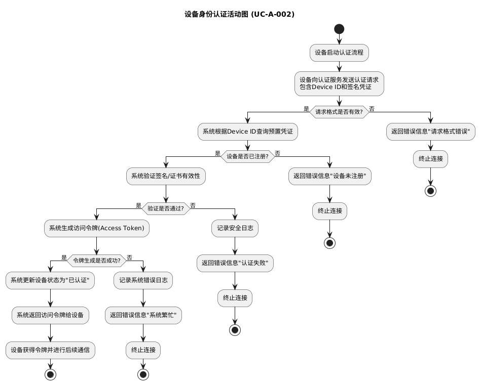
图A-4：设备身份验证活动图
核心流程是：设备发起请求后，系统依次验证请求格式、检查设备是否注册、校验凭证签名，全部通过后则生成访问令牌并更新设备状态，最终认证成功。
同时，图表也明确规定了异常处理路径：在上述任一验证步骤失败时，系统会记录相应日志、返回具体的错误信息，并终止连接，确保了流程的严谨性与安全性。

5.1.1.5顺序图
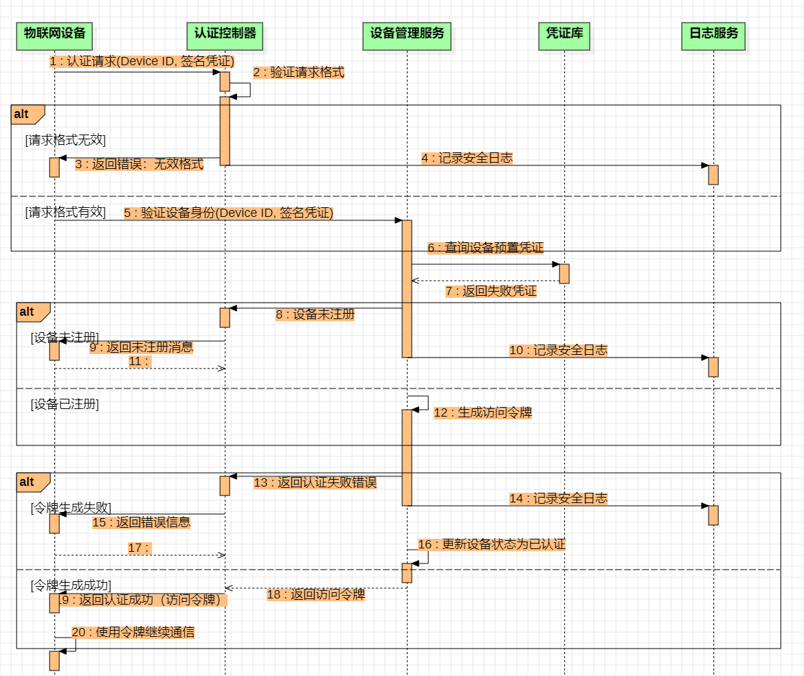
其核心在于一个链式验证过程：设备发起请求后，系统依次通过认证控制器、设备管理服务等模块，逐步完成请求格式校验、设备注册状态核查和数字签名验证。只有所有验证均通过，系统才会生成访问令牌并返回给设备，认证成功。整个流程被设计得严谨且安全，对于任一环节的验证失败，系统都会立即终止流程、返回明确的错误信息并记录安全日志，确保了认证机制的可控与可追溯。 
5.2子系统B用例文档（由【吴思扬】负责）
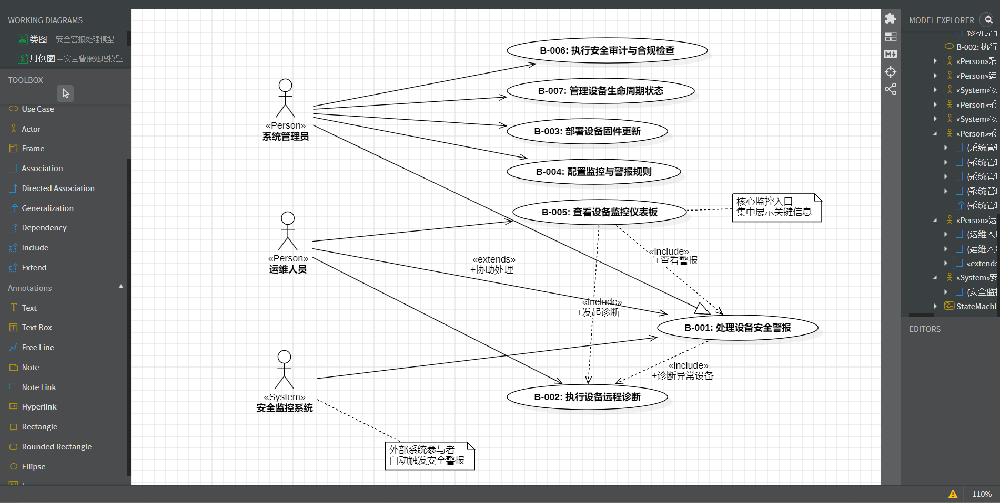
用例号	UC-B-001
用例名称	处理设备安全警报
用例描述	当安全监控系统检测到设备异常行为（如非法访问、流量异常）时，会生成警报。系统管理员查看警报，分析详情，执行必要的应急响应操作，并最终将警报标记为已处理。
参与者	系统管理员（主要），安全监控系统（次要）
前置条件	1.系统管理员已成功登录系统。
2.安全监控系统正常运行，并已配置警报规则
后置条件	安全警报的状态被更新，并记录了处理日志。如果需要，设备可能被隔离或配置被修改。
基本路径	1.安全监控系统检测到异常，自动创建一条新的安全警报，状态为“待处理”。
2.系统管理员进入警报管理界面，系统显示“警报列表”。
3.系统管理员选择一条状态为“待处理”的高优先级警报进行查看。
4.系统显示该警报的详细信息（触发设备、时间、警报类型、风险等级、相关日志）。
5.系统管理员分析信息后，决定执行“隔离设备”的应急响应。
6.系统执行隔离操作，并将操作结果反馈给管理员。
7.系统管理员将警报状态标记为“已处理”，并填写处理备注。
8.系统更新警报状态，并记录完整的处理流水日志。
扩展点	5a.如果分析后发现是误报
   系统管理员可直接将警报标记为“误报”，无需执行应急响应。
6a.如果隔离设备失败
   系统提示操作失败原因，流程退回到第5步，管理员可选择其他响应措施或上报。
补充说明	略

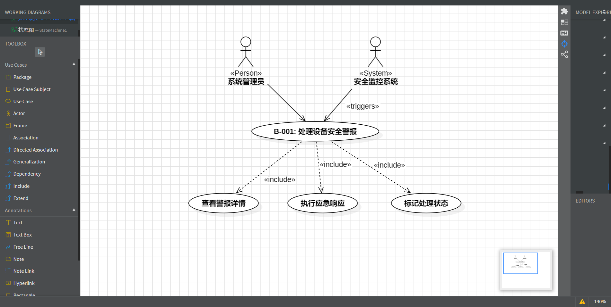
图B-2：处理设备安全警报用例图

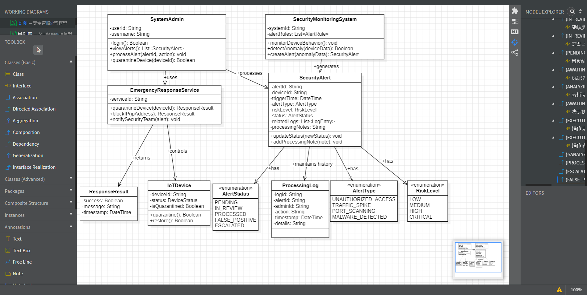
图B-3：处理设备安全警报类图
本类图描绘了物联网安全警报处理模型的核心静态结构。该设计采用面向对象思想，清晰地展现了各组件职责与协作关系。
核心是 SecurityMonitoringSystem（安全监控系统），它作为系统的驱动者，持续监控设备行为，负责根据规则检测异常并生成​ SecurityAlert（安全警报）。
SystemAdmin（系统管理员）​ 作为系统的使用者，通过调用系统提供的功能来处理安全警报，并可对相关设备执行隔离等操作。警报的处理过程和结果被详细记录在 ProcessingLog（处理日志）​ 中，确保了操作的可审计性。
SecurityAlert（安全警报）​ 作为核心业务实体，通过 AlertType（警报类型）、RiskLevel（风险等级）​ 和 AlertStatus（警报状态）​ 等枚举类型精确描述其属性，并通过关联关系与受影响的 IoTDevice（物联网设备）​ 及处理记录相连。
整个设计通过关联、依赖等关系将监控、警报、处理、设备、日志等元素紧密连接，体现了高内聚、低耦合的原则，构建了一个职责清晰、流程闭环的安全事件处理模型。

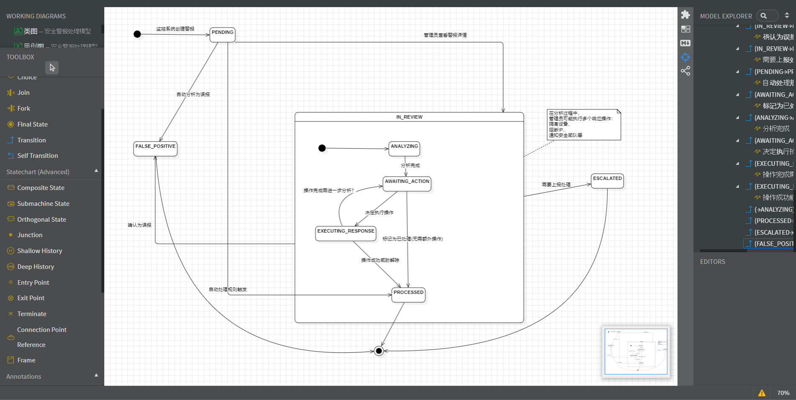
图B-4：处理设备安全警报活动图

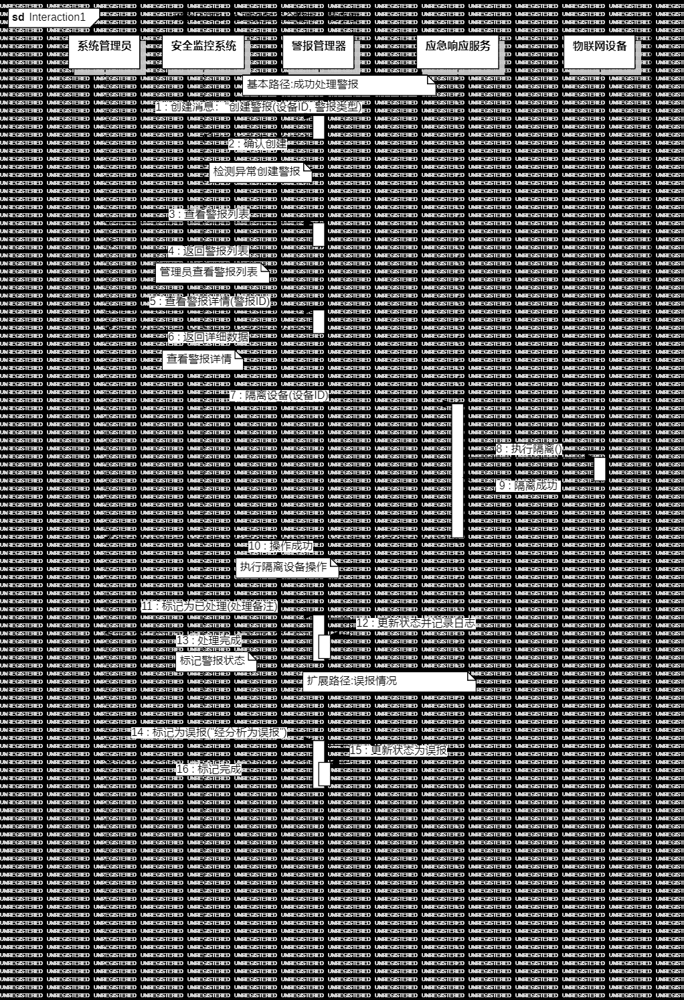
图B-5：处理设备安全警报顺序图

5.3子系统C用例文档（由【帅军锐】负责）
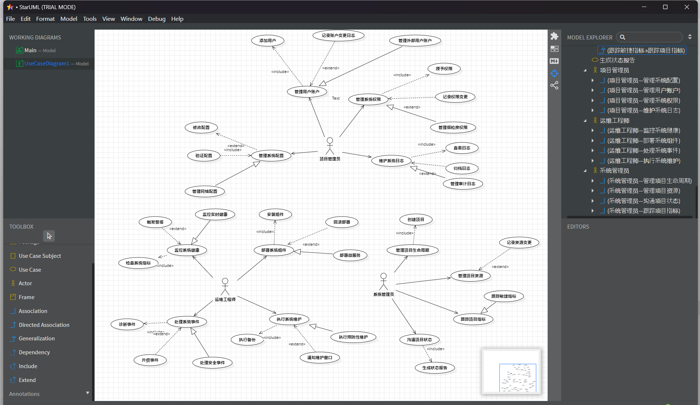
图C-1：设备接入与安全认证子系统图

用例号	UC-C-006
用例名称	部署系统组件
用例描述	本用例描述了运维工程师将新的或更新的系统组件（如软件、服务、补丁）部署到目标环境（如测试、生产环境）的一系列活动，旨在确保部署过程可靠、可控，并在出现问题时能够回退。
参与者	运维工程师
前置条件	1. 运维工程师已成功登录系统。
	2. 需要部署的组件包已经通过验证并准备就绪。
	3. 目标部署环境（如服务器、网络）已准备就绪并可访问。
后置条件	1. 成功：系统组件被成功部署并激活，系统处于新的稳定状态。
	2. 失败：部署失败，系统被回退到部署前的稳定状态。
基本路径	1. 运维工程师在系统界面选择“部署系统组件”功能。
	2. 系统显示部署向导，要求选择部署包和目标环境。
	3. 运维工程师上传或选择指定的组件部署包，并选择目标环境。
	4. 系统验证部署包的完整性和目标环境的兼容性。
	5. 验证通过后，系统自动执行预部署备份（如备份当前版本组件）。
	6. 系统开始将新的组件包安装或更新到目标环境。
	7. 系统执行部署后配置和服务重启。
	8. 系统运行一组基本的健康检查以验证新组件是否正常工作。
	9. 健康检查通过，系统提示部署成功，并记录部署日志。
扩展点	在步骤6或8中：部署失败或健康检查失败
	6a. 系统检测到部署过程出现错误（如文件复制失败）。
	    6a1. 系统暂停部署流程，自动触发回滚操作（参见UC-C-29：回滚部署）。
	    6a2. 系统将环境恢复至部署前的备份状态。
	    6a3. 系统向运维工程师发送部署失败和已回滚的通知。
	    6a4. 本用例结束。
	8a. 系统健康检查失败（如服务无法启动、接口异常）。
	    8a1. 系统自动触发回滚操作（参见UC-C-029：回滚部署）。
	    8a2. 系统将环境恢复至部署前的备份状态。
	    8a3. 系统向运维工程师发送健康检查失败和已回滚的通知。
	    8a4. 本用例结束。
补充说明	1. 包含关系：本用例包含了“安装组件”（UC-C-028）的步骤。
	2. 扩展关系：本用例被“回滚部署”（UC-C-029）所扩展，即在发生失败时执行。
	3. 泛化关系：本用例是一个通用的部署流程。对于特定的架构，如“部署微服务”（UC-C-030），是其特化，可能涉及容器编排等不同的具体步骤。

5.3.1.2 用例图
从用户功能视角系统性地定义了“部署系统组件”这一核心用例的完整生态，不仅明确了主要参与者“运维工程师”，还通过«include»关系指出“安装组件”是部署过程中必须执行的子任务，通过«extend»关系定义了在异常情况下可选的“回滚部署”扩展点，并通过“部署微服务”展示了从核心用例泛化出的特化场景；此外，图中清晰标注的前置条件（如用户登录、环境就绪）以及模型资源管理器里展示的其他角色（如项目管理员、系统管理员）及其关联用例，共同勾勒出系统在部署功能上的完整需求边界和用户交互全景。

5.3.1.3 类图

精准定义了“运维工程师”、“部署系统”、“部署包”、“目标环境”、“部署日志”等核心实体类，每个类都清晰列出了关键属性（如部署ID、状态、版本号）和核心操作（如验证、安装、回滚）；同时，通过“使用”、“验证”、“记录”等关联关系以及“部署状态”枚举类，完整地展示了这些类之间如何相互协作以支撑整个部署流程的运作，为系统开发提供了直接的编码依据。

5.3.1.4 状态图

以流程图形式动态刻画了部署任务从开始到结束的完整内部控制流，从“未开始”状态出发，逐步经过包含“验证部署包”、“验证目标环境”子活动的“验证中”复合状态，并根据验证结果分支到成功（进入“备份中”）或失败（结束）路径；随后活动流进入“部署中”状态，依次执行“停止旧服务”、“安装新组件”、“启动新服务”等关键步骤，任何步骤失败都会跳转至“回滚中”状态；最终，通过“健康检查中”状态的判定，活动以“已完成”或“已回滚/已失败”结束，清晰地揭示了流程中所有可能的决策点和状态迁移。

5.3.15 顺序图

按严格时间顺序直观呈现了部署过程中各软件对象间的动态交互细节，始于“运维工程师”角色向“部署系统”对象发送“启动部署流程”消息，继而触发一系列同步消息调用链，包括请求“验证服务”校验环境、通知“备份服务”执行备份、指令“部署引擎”安装组件，以及要求“健康检查”服务进行最终验证；图中不仅用序号标明了成功路径下消息的严格时序，还明确展示了异常分支（如“安装失败”）如何触发系统内部“执行回滚操作”并最终向用户返回“部署失败，已回滚”的反馈，完整体现了对象间的协作协议。

5.4子系统D用例文档（由【林世颖】负责）
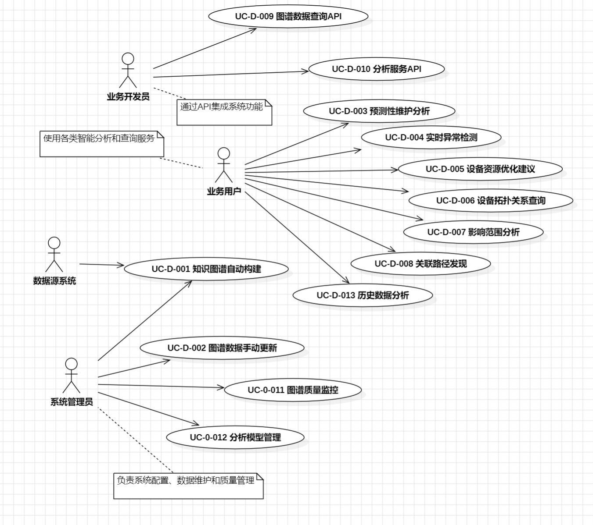
图D-1：知识图谱分析与智能服务子系统图

5.4.1UC-D-003预测性维护分析
5.4.1.1用例描述

用例编号​	UC-D-003
用例名称​	预测性维护分析
参与者​	运维工程师
用例描述​	基于设备运行数据和机器学习算法，预测设备的潜在故障和维护需求
前置条件​	1. 设备运行数据完整
	2. 预测模型已训练完成
	3. 用户有相应权限
后置条件​	生成预测报告和维护建议
基本路径​	1. 用户选择目标设备或设备组
	2. 设置分析时间范围和参数
	3. 系统执行预测分析算法
	4. 显示预测结果和置信度
	5. 生成维护建议清单
	6. 用户确认或导出报告
扩展点​	1. 数据不足时，提示补充数据需求
	2. 高风险预警时，自动发送告警通知
​补充说明	预测结果置信度低于70%时需要人工复核

5.4.1.2用例图
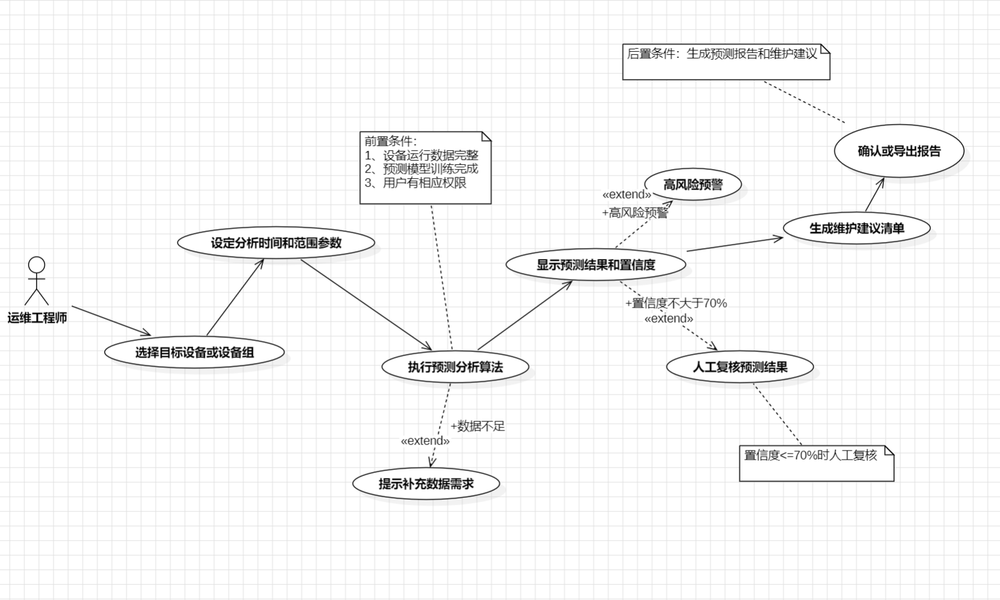
图D-2：预测性维护分析用例图

5.4.1.3类图

图D-3：预测性维护分析类图

5.4.1.4状态图
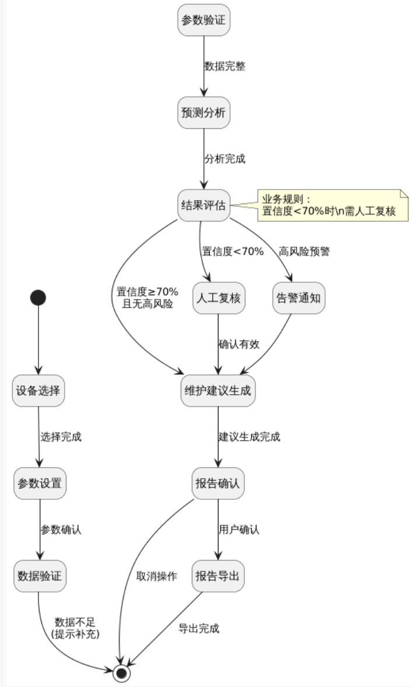
图D-4：预测性维护分析状态图

5.4.1.5顺序图
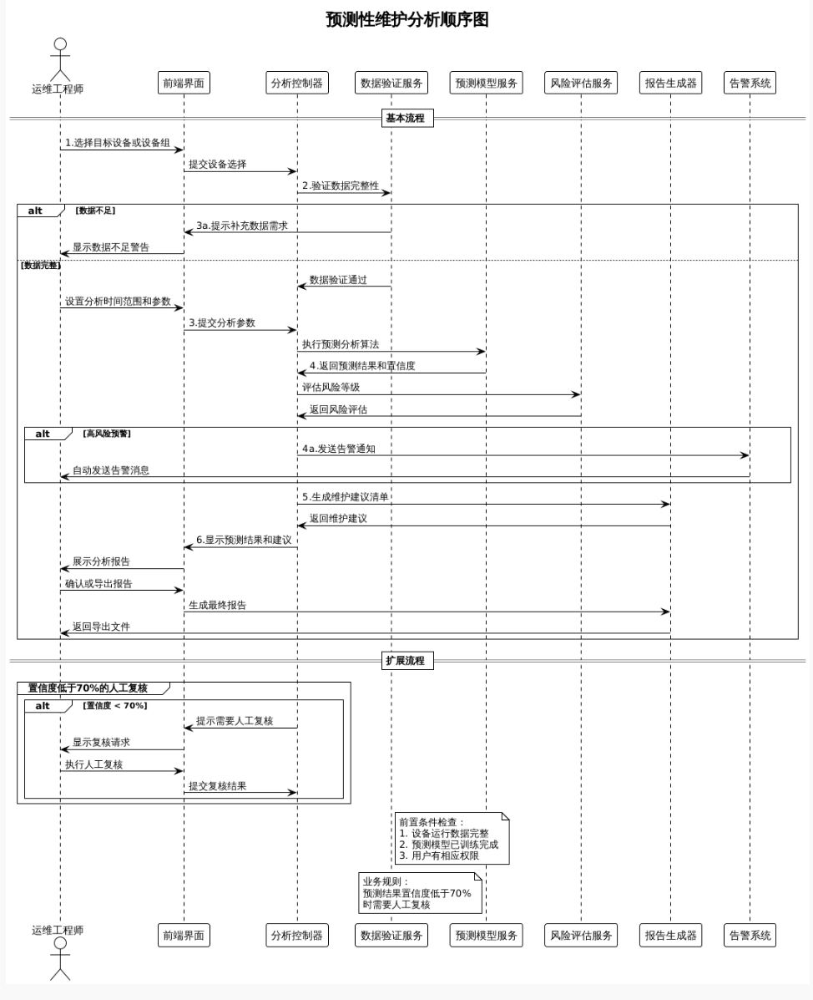
图D-5：预测性维护分析顺序图

六、非功能性需求
6.1可靠性
6.1.1安全性
安全性是系统稳定运行的基石，我们采取了多项措施确保数据传输的安全性和操作的可审计性。首先，所有数据传输均采用业界标准的加密协议，如TLS（传输层安全协议），确保数据在传输过程中的机密性和完整性。其次，系统对所有关键操作进行日志记录，包括用户身份、操作时间、操作内容等详细信息，便于事后审计和问题追踪。此外，我们还实施了严格的权限控制和访问管理策略，确保只有授权用户才能执行特定操作。

6.1.2事务性（如：设备配置更新需保证原子性）
在设备配置更新等关键操作中，我们确保了事务的原子性，即操作要么完全成功，要么完全不执行。这通过使用数据库事务管理来实现，确保在发生故障时，系统能够回滚到操作前的状态，避免数据不一致的问题。此外，我们还设计了自动重试机制和故障转移策略，以应对网络波动或设备故障导致的更新失败。

6.2可用性
为了确保用户能够高效地使用系统，我们特别注重界面的简洁性和操作的直观性。界面设计遵循最小化干扰原则，只展示必要的信息和操作选项，避免用户在使用过程中感到困惑。同时，我们对常用功能进行了优化，确保用户能够通过最少的步骤完成任务。此外，系统还支持多种设备和浏览器，确保用户可以随时随地访问系统。

6.3有效性
6.3.1性能
系统设计时充分考虑了性能要求，以支持大规模设备的高效管理。我们实现了高效的设备状态同步机制，确保系统能够实时监控和管理多达10万台设备。同时，告警系统具备快速响应能力，能够在3秒内对设备异常情况进行告警，帮助运维人员及时发现并解决问题。
6.3.2可维护性
系统的可维护性体现在多个方面。首先，我们提供了详细的系统文档和API文档，方便开发人员和运维人员理解和使用系统。其次，系统设计遵循模块化原则，各个模块之间耦合度低，便于单独维护和升级。此外，我们还实现了自动化的部署和更新流程，减少了人工干预，降低了维护成本。
6.3.3可扩充性
随着业务的发展，系统需要能够灵活地进行扩充。我们采用了微服务架构，使得系统可以按需增加新的服务模块，而不会影响现有服务的运行。同时，系统支持横向扩展，通过增加服务器资源来提升处理能力，确保系统能够应对不断增长的业务需求。此外，我们还提供了开放的API接口，方便与其他系统进行集成，实现数据共享和功能互补。
