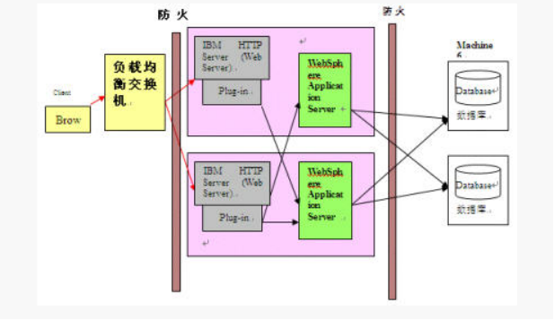
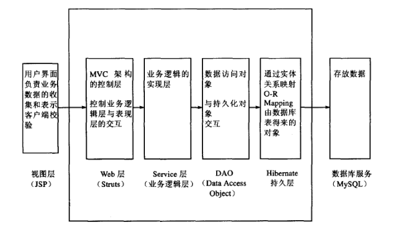
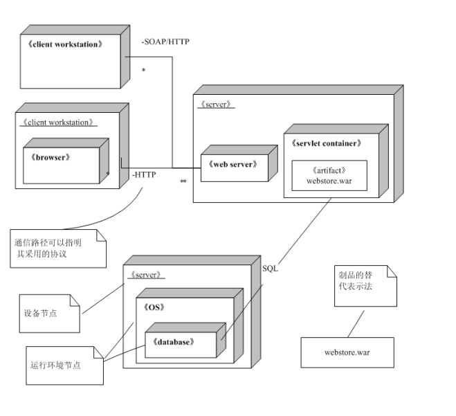
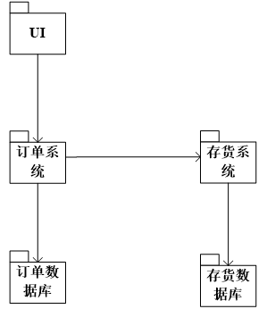
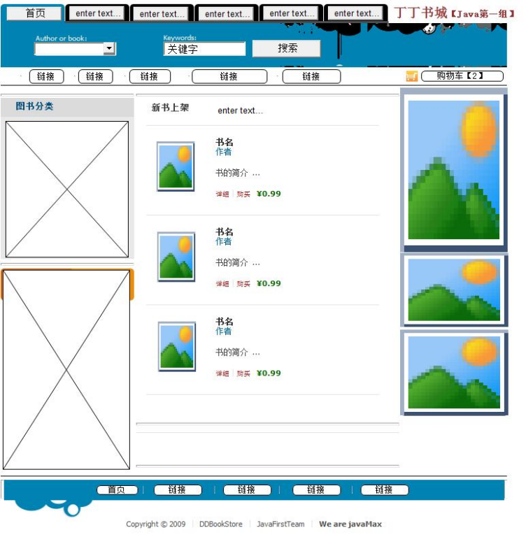
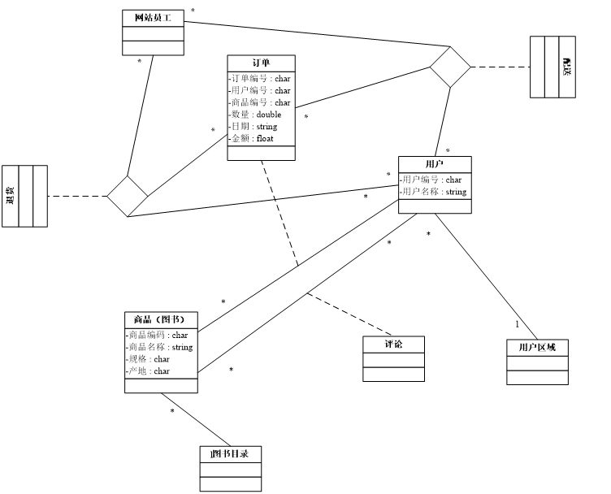
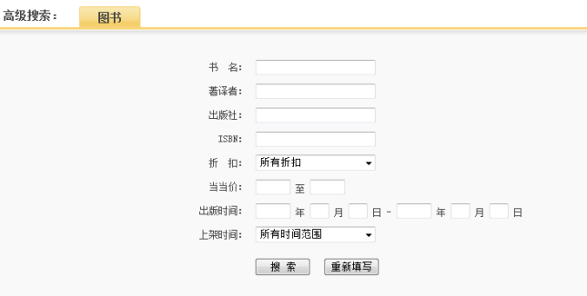
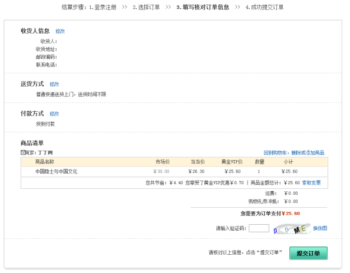

丁丁网上书城  系统
概要设计
Version r.0.0.1

修订历史
(日期	版本	描述	作者)的表格

目  录
丁丁网上书城  系统	2
概要设计	2
1 绪言和目标	2
3.1.1 目的	2
3.1.2 范围	2
3.1.3 定义及缩写	2
3.1.4 参考	2
3.2	项目背景	2
3.2.1 目标概要	2
3.2.2 方案概要	2
3.3	外部因素	2
3.3.1 存在的应用软件	2
3.3.2 第三方应用软件	2
3.3.3 外部数据源	2
3.4	技术技能	2
3.5	解决方案架构	2
3.5.1 系统体系结构	2
3.5.2 网络和通讯视图	2
3.5.2.1 系统部署图	2
3.5.3 模块视图	2
3.5.4 用户界面	2
3.6	未鉴别因素	2
3.7	研发风险	2
3.8	绪言及目标	2
3.9	范围	2
3.10	定义及缩写	2
3.11	引用	2
3.12	角色及职责	2
3.13	工具及环境	2
3.13.1 研发硬件配置	2
3.13.2 研发语言及编译器	2
3.13.3 软件支持工具	2
3.13.4 第三方工具	2
3.14	高层分析	2
E-R图	2
3.15	详细设计	2
3.15.1 数据库定义	2
3.15.1.1 数据表描述	2
3.15.1.2 数据表结构	2
3.15.2 用户界面设计	2

1 绪言和目标
3.1.1目的
从该阶段开发正式进入软件的实际开发阶段，本阶段完成系统的大致设计并明确系统的数据结构与软件结构。在软件设计阶段主要是把一个软件需求转化为软件表示的过程，这种表示只是描绘出软件的总的概貌。本概要设计说明书的目的就是进一步细化软件设计阶段得出的软件总体概貌。
3.1.2范围
本阶段在系统的需求分析的基础上，对QC配置管理系统作概要设计。主要解决实现该系统需求的程序模块设计问题。包括如何把该系统划分成若干个模块、决定各个模块之间的接口、模块之间传递的信息，以及数据结构、模块结构的设计等。在以下的概要设计报告中将对在本阶段中对系统所作的所有概要设计进行详细地说明。
在下一阶段的详细设计中，程序设计员可参考本概要设计报告，在概要设计对QC配置管理系统所做的模块结构设计的基础上，对系统进行详细设计。在以后的软件测试以及软件维护阶段也可参考此说明书，以便于了解在概要设计过程中所完成的各模块设计结构，或在修改时找出在本阶段设计的不足或错误。

3.1.3定义及缩写
缩写	定义
外部数据源	用于连接数据库的一组存储的“源”信息
总体设计	即对有关系统全局问题的设计，也就是设计系统总的处理方案，又称系统概要设计。它包括：计算机配置设计、系统模块结构设计、系统可靠性与内部控制设计等内容。

3.1.4 参考
文档名称	文档标题
需求规格说明书	Java_D0901_0102_需求规格说明书_r.0.0.1.doc
	《项目计划》（Version r.0.0.1）
 
3.2项目背景
3.2.1目标概要
丁丁网上书城为浏览用户提供书籍浏览服务，为注册会员提供购书、退换货服务，同时也为内部的系统管理、客户服务和配送管理提供服务。
3.2.2方案概要
在B/S框架下，采用SSH技术，以Spring为核心，通过Struts提供业务展现功能，通过Hibernate提供数据访问持久化功能。业务展现以JSP为切入点，通过Action bean进行业务流程控制，通过Service bean为业务逻辑提供支持。
硬件及软件
服务器：IBM pSeries 690小型机服务器 
中间件：WebSphere Application Server V6.0 
数据库：DB2 UDB ENTERPRISE SERVER EDITION V8.1 
应用系统逻辑架构如下所示：

3.3外部因素
所有开发工具已经准备齐备，除测试工具外，均已调用，并已应用于开发。因此外部因素的风险较小。
3.3.1存在的应用软件
WebSphere Application Server V6.0
3.3.2第三方应用软件
无
3.3.3外部数据源
MySQL
3.4技术技能
目前开发小组已经完成需求分析，进入到设计阶段，对相关技术、工具有了一定的了解和应用技能。但对Rational Rose、Dreamwaver等模型设计、界面原型设计等工具熟练程序有限，使得开发进度存在一定的风险，但这种风险较小。
3.5解决方案架构
3.5.1系统体系结构

本系统采用的是典型的J2EE 三层结构，分为表现层、中间层(业务逻辑层)和数据库服务层。三层体系将业务规则、数据访问及合法性校验等工作放在中间层处理。客户端不直接与数据库交互，而是通过组件与中间层建立连接，再由中间层与数据库交互。
表现层：是传统的JSP 技术， JSP 技术自1999 年问世以来，经过多年的发展，其广泛的应用和稳定的表现，为其作为表现层技术打下了坚实的基础。
中间层：采用的是流行的Spring+Hibernate ，为了将控制层与业务逻辑层分离，又细分为以下几种。Web 层，就是MVC 模式里面的交互，调用业务逻辑层，并将业务数据返回给表现层作组织表现，该系统的MVC 框架采用Struts 。Service 层(就是业务逻辑层)，负责实现业务逻辑。业务逻辑层以DAO 层为基础，通过对DAO 组件的正面模式包装，完成系统所要求的业务逻辑。DAO 层，负责与持久化对象交互。该层封装了数据的增、删、查、改的操作。PO ，持久化对象。通过实体关系映射工具将关系型数据库的数据映射成对象，很方便地实现以面向对象方式操作数据库，该系统采用Hibernate 作为ORM 框架。Spring 的作用贯穿了整个中间层，将Web 层、Service 层、DAO 层及PO 无缝整合，
数据库服务层:使用MySql 数据库存储持久化数据。
3.5.2网络和通讯视图
本系统采用Struts+Spring+Hibernate的架构原型。用户的请求会发送给ActionServlet,用户数据通过ActionForm Bean传递给Action，由Action类来通过Spring的Ioc容器访问Hibernate的DAO，DAO负责数据库的交互，然后再返回JSP页面进行显示。
3.5.2.1系统部署图

3.5.3模块视图
这里介绍划分为哪些模块。如用uml设计则需要给出包图，如果为结构化设计，则给出模块结构图。例子如下：
以下两种方式供同学们参考（并非本设计的图，仅供参考图的样式），第一种为包图，是采用面向对象的设计时候用的，第二种为模块结构图，是结构化设计时候用的。二种选一即可。
包图：

3.5.4用户界面

3.6未鉴别因素
多表查询、复杂数据查询、快速数表集展现与数据操纵等技术不熟悉对开发进度及技术选用的影响。
3.7研发风险
未鉴别因素及已识别因素所造成的风险均不会太大，虽然任务比较多，但完成核心功能的成功会比较。如果时间来不及，可能造成部分扩展功能不完善。

 丁丁网上书城   系统
详细设计

Version r.0.0.1
修订历史
(日期	版本	描述	作者)表

目  录
1	绪言及目标	2
2	范围	2
3	定义及缩写	2
4	引用	2
5	角色及职责	2
6	工具及环境	2
6.1	研发硬件配置	2
6.2	研发语言及编译器	2
6.3	软件支持工具	2
6.4	第三方工具	2
7	高层分析	2
E-R图	2
8	详细设计	2
8.1	数据库定义	2
8.1.1	数据表描述	2
8.1.2	数据表结构	2
8.2	用户界面设计	2

3.8绪言及目标

软件设计是把软件需求变换成为软件的具体设计方案，即模块结构的过程。软件设计一般分为概要设计和详细设计两个阶段。概要设计阶段根据软件需求分析所得到的数据流程或数据结构，使用结构化设计技术，导出软件的模块结构。详细设计阶段是给出软件模块的内部过程描述。内部过程描述是模块内部的算法设计。
本文档为“丁丁网上书城系统详细设计说明书”，主要用于为实现系统的功能而进行的系统详细设计说明，详细描述了系统各软件组成模块的实现流程、功能、接口、编译、测试要点等内容，便于对系统的编码进行指导和约束。
本说明书的预期读者为项目组全体成员及项目组领导，单元测试人员。
3.9 范围
本文档用于软件设计阶段的详细设计，该详细设计的范围是：系统各组成部分的构成、各子系统的公用模块实现设计、专用模块实现设计等。

3.10定义及缩写 
表
缩写	定义
E-R 图	实体关系图

3.11 引用
表
文档名	文档标题
Java_D0901_0102_需求规格说明书_a.0.0.3.doc	丁丁网上书城系统 需求规格说明书
D0901_术语表_r.0.0.1.doc	术语表
D0901_数据模型_r.0.0.1.doc	数据模型

3.12角色及职责
表
姓名	角色	职责
空	PM	监督项目、项目计划与实施、调配人员
空	SQA	软件质量保证
空	SCM	配置管理
空	DBA	数据库管理
空	Tester	集成测试、功能测试

3.13工具及环境
3.13.1研发硬件配置
硬件配置	最低要求
CPU	Pentium 4 以上
RAM	1G以上
硬盘	5G以上

3.13.2研发语言及编译器
类别	技术方法
开发语言	JAVA 、HTML、JSP
系统架构	SSH架构
编译器	MyEclipse  Dreamweaver

3.13.3软件支持工具
类别	工具
操作系统	Windows
服务器软件	Apache Tomcat 5.5
数据库软件	MySQL 5.0
浏览器	IE兼容

3.13.4第三方工具

类别	工具
系统开发	MyEclipse 5.5.1GA
页面设计	Dreamweaver
数据库设计	PowerDesigner
服务器软件	Apache Tomcat 5.5

3.14高层分析
E-R图

3.15详细设计
3.15.1数据库定义
3.15.1.1数据表描述

表名	描述
Customer	用户信息表，管理注册会员信息
Book	图书信息表，管理图书信息
BookCategory	图书分类表，管理图书类别信息
BookOrder	订单信息表，管理订单信息
OrderItem	订单项表，管理订单的详细项信息
GZArea	区域表，管理用户所在区域信息
DeliveryList	配送单表，管理配送单信息
RefundList	退换货单表，管理退换货单信息
RefundItem	退换货单项表，管理详细退换货单信息
InternalUser	内部用户表，管理内部用户信息
Comment	图书评论表，管理图书评论信息

3.15.1.2数据表结构

表Book
字段	名称	数据类型	P	U	F	I	C	备注
bookID	书号	INTEGER(11)	√					自增1
bookCategoryID	类别	VARCHAR(3)			√			类别，引用类别表的类别ID
bookName 	书名	VARCHAR(100)						
Author	作者	VARCHAR(30)						NULL
ISBN	ISBN号	VARCHAR(20)						NULL
Press	出版社	VARCHAR(30)						NULL
publishDate	出版日期	DATE						NULL
Version	版本号	VARCHAR(10)						NULL
Abstract	简介	VARCHAR(500)						NULL
Price	价格	VARCHAR(10)						NOT NULL
Catalogue	目录	VARCHAR(100)						NULL,这里存放目录文件的相对地址
inventoryData	库存量	VARCHAR(10)						NULL
Cover	封面	VARCHAR(100)						NULL,封面图片，这里存放封面文件的相对地址

表BookCategory
字段	名称	数据类型	P	U	F	I	C	备注
bookCategoryID	书类别ID	VARCHAR(3)	√					数据库中已添加类别
bookCategoryName	书类别名称	VARCHAR(30)						

表BookOrder
字段	名称	数据类型	P	U	F	I	C	备注
ordered	订单号	INTEGER(11)	√					自增1
customerID	会员号	INTEGER			√			外键引用用户表会员号
statusOrder	订单状态	CHAR(1)						0表示未送货,1表示已送货
createDate	生成时间	DATETIME						订单生成时间
confirmDate	确认时间	DATETIME						用户收到图书后的确认时间
deliveryDate	配送时间	DATETIME						配送员配送时间
Freight	运费	VARCHAR(4)						NULL

invoiceTitle	发票抬头	VARCHAR(40)						NULL,发票填写的单位名称
invoiceContent	发票内容	VARCHAR(20)						NULL,如图书、文具等

表Comment
字段	名称	数据类型	P	U	F	I	C	备注
commented	评论号	INTEGER(11)	√					自增1
bookID	书号	INTEGER(11)			√			引用图书表的书号
customerID	会员号	INTEGER			√			引用用户的用户号
Content	内容	VARCHAR(500)						250个汉字
publishDate	发表时间	DATETIME						NULL

表Customer
字段	名称	数据类型	P	U	F	I	C	备注
customerID	会员号	INTEGER	√					自增1
areaID	区域号	VARCHAR(2)			√			类别，引用区域表的区域ID
Mailbox	电子邮箱	VARCHAR(50)						NOT NULL
Password	密码	VARCHAR(20)						NOT NULL密码最长20个字符
Name	姓名	VARCHAR(30)						NULL
Telephone	电话	VARCHAR(20)						NULL
mobilePhone	手机	INTEGER(11)						NULL
Address	地址	VARCHAR(250)						NULL
postcalCode	邮编	INTEGER(6)						NULL长度为6的数字
registrationDate	注册时间	DATETIME						NULL

表DeliveryList
字段	名称	数据类型	P	U	F	I	C	备注
deliveryListID	配送单号	INTEGER(11)	√					自增1
ordered	订单号	INTEGER(11)			√			NOT NULL,订单号
userID	配送员的用户ID	INTEGER(11)			√			NOT NULL,配送员的用户ID
customerID	会员号	INTEGER			√			NOT NULL
deliveryDate	配送时间	DATETIME						NULL
statusDelivery	配送状态	CHAR(1)						NULL,是否已送货，1为已送，0为未送,默认为0

表GZArea
字段	名称	数据类型	P	U	F	I	C	备注
areaID	区域号	VARCHAR(2)	√					数据库中已添加类别
areaName	区域名	VARCHAR(20)						

表InternalUser
字段	名称	数据类型	P	U	F	I	C	备注
userID	内部用户号	INTEGER(11)	√					自增1
Name	姓名	VARCHAR(30)						
Password	密码	VARCHAR(20)						
Role	角色	CHAR(1)						0为系统管理员，1为仓库管理员，2为配送员，3为客服
Telephone	电话	VARCHAR(20)						NULL

表OrderItem
字段	名称	数据类型	P	U	F	I	C	备注
orderitemID	项号	INTEGER(11)	√					自增1
bookID	书号	INTEGER(11)			√			引用图书表
orderID	订单号	INTEGER(11)			√			引用订单表
amount	购买本数	INTEGER(11)						默认为1
outofStock	是否缺货	VARCHAR(1)						NULL是否缺货，"1"缺货，"0"不缺货

表RefundItem
字段	名称	数据类型	P	U	F	I	C	备注
refundItemID	系统自动增加1	INTEGER(11)	√					自增1
refundListID	退换货单号	INTEGER(11)			√			引用退换货表
bookID	书号	INTEGER(11)			√			引用图书表
applyAmount	申请退换货数量	VARCHAR(6)						NULL
approveAmount	批准退换货数量	VARCHAR(6)						NULL

表RefundList
字段	名称	数据类型	P	U	F	I	C	备注
refundListID	退换货单号	INTEGER(11)	√					自增1
orderID	订单号	INTEGER(11)			√			引用订单表
createDate	生成时间	DATETIME						NULL
statusRefund	处理状态	CHAR(1)						NULL退换货单处理状态, 0为未处理, 1为已处理
flag	退换货标志	CHAR(1)						NOT NULL,0为退货，1为换货

3.15.2用户界面设计

用例号	UC001
用例名称	用户注册

用例号	UC002
用例名称	用户登录

用例号	UC003
用例名称	用户退出

用例号	UC004
用例名称	查看书籍

用例号	UC005
用例名称	购物车管理

用例号	UC006
用例名称	结算

四、实验中遇到的困难及解决方法
  1.动态建模中用例的活动图跟状态图总是分不太清，状态图每个长方形框中的是状态，而且它的对象只有一个，但是活动图就不一样，活动图的长方形框中写的是每个操作，对象可以有多个。（邓XX）
  2.还有顺序图，其实它比较强调的是一个事件的顺序，顺序性比较强，强调执行完这一步下一步应该是哪一步。不像活动图一样，强调活动的转换。（邓XX）
3.状态图和活动图有相似之处，但状态图强调的是对对象的生命周期建模以及对反应型对象的行为建模，而活动图主要强调的是从活动到活动的控制流。所以区分好这两种图所描述的内容是动态建模的基础。（左XX）
4.顺序图强调的是事件的顺序，所以在画顺序图的时候要想清楚每一步完成之后的结果及接下来的要执行的步骤，要清楚一个对象的生命周期有多长，也要考虑顺序图的结构。（左XX）
   5.不熟悉顺序图的概念：顺序图将交互关系表示为一个二维图。纵向是时间轴，时间沿竖线向下延伸。横向轴代表了在协作中各独立对象的类元角色。类元角色用生命线表示。当对象存在时，角色用一条虚线表示，当对象的过程处于激活状态时，生命线是一个双道线。
消息用从一个对象的生命线到另一个对象生命线的箭头表示。箭头以时间顺序在图中从上到下排列。（陈XX）

五、心得体现
 张XX：
1.用户管理在现代的市场非常重要，用户量的大小决定了一家公司的成败，要想有效管理用户，就必须做好用户管理这一大模块；这一模块可以包含很多个人信息，对个人信息的管理，也方便以后用户条件查找。
2.团队分工很重要。要按照不同人不同能力，适合、擅长做哪个来分工，这样团队才会有进度可言。队长也要及时督促一下团队队员，定时审核一下，开会讨论交流一下互道的问题，在整个过程中，大家的讨论、交流是非常重要的。
3.活动图、状态图、顺序图要根据之前的用例图、用例描述来展开，所以用例描述很重要。
邓XX：
1.从需求分析到用户动态建模，其实每一步都很关键，尤其是用例的确认和用例分析，如果是一开始的方向没有确定好，最后的工作肯定很麻烦，因为前面的分析都会跟后面每一步紧密相连。
2.其次，一个组的分工也很重要，队长要组织好分工，多点组织队员间进行交流。同时，如果队员间有什么问题都要及时的提出，队间及时对问题进行改进并提出更好的解决方案，做到对自己工作清晰明了，对工作认真。

左XX：

1.本实验前部分进行了静态建模（包括用例图建模和类图建模）。用例图建模部分，我们经过小组讨论，将整体的用例图框架构建出来。并经过分工，由我负责“管理好友子系统”（可参见类图），类图的构建基于程序的初步设计，需要考虑的内容和细节很多。用例描述部分基于用例图的设计，并将每个用例的细节描绘出来。静态建模部分总体来说比较简单，但需要细心和耐心。需求描述部分可以说是最基础也最重要的部分，之后所有类型的图的建模都离不开需求描述，而且若产生冲突还需要重新修改和完善需求。

2.本实验后部分主要进行了动态建模（包括状态图，活动图，顺序图和协作图）。在动态建模的过程中需要考虑很多细节性的问题。同时不能抛开用例图和用例描述，只有紧密结合用例描述并考虑其中可行的功能实现才能更好的将以上所述的图画出来。动态建模同静态建模，也是不断修改和完善的过程。除了负责一开始所分出的子系统之外，我们也就彼此的子系统所出现的问题进行了讨论，指出各种图中出现的错误，并努力加以改动和完善。不是只为了完成一份报告，在互相讨论，提出问题和解决问题的过程中我们也收获了很多知识和处理问题的能力。

3.经过本次实验，加深了我对UML统一建模语言的认识，也掌握了静态和动态建模的知识和技巧，虽然还有很多不足，但我相信只要掌握了基础，再努力仔细加以斟酌，定能弥补不足，构建出较为完善的模型。同时要感谢老师的指导和队友的帮助，我们能顺利完成软件工程和uml的作业，离不开老师的指导，也离不开我们自己的努力和耐心，一起加油吧！

陈XX：
 1.在团队合作中一定要做好自己的分工合作，做到个人不影响团队的效率。
 2.在画顺序图时要看回之前画好的用例图和类图，然后明确时间发生的顺序，一步紧接上一步地把图画好。
 3.画状态图和活动图时遇到不明白不理解的地方除了参考网上的介绍，还参考了队友的画法，不懂的就多看，多参考。
